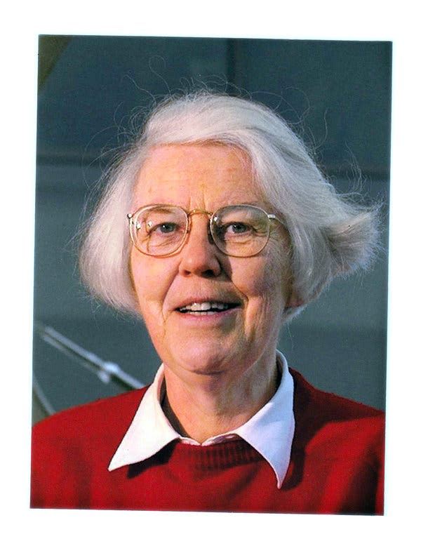

# h1
### LIST:
* #### Ada Lovelace
* #### Karen Spärck Jones


`Ada Lovelace`

#### Augusta Ada King-Noel, Countess of Lovelace
```
An extraordinary female mathematician and witer who had significant attribution to the science field and is recognized as the first computer programmer.
```
--Obituary
She was born on _**Dec.10.1815**_ and died on _**Nov.27.1852**_.


She met with Baggage when she was 17.
In 1840, Lovelace asked Augustus De Morgan, a math professor in London, to tutor her. Through exchanging letters, he taught her university-level math.
She published the translation of an academic paper about the Babbage Analytical Engine and added a section, nearly three times the length of the article, titled _ "Notes."_ and this _ "Notes"_ have significant influence on modern
"She also explored the ramifications of what a computer could do, writing about the responsibility placed on the person programming the machine, and raising and then dismissing the notion that computers could someday think and create on their own — what we now call artificial intelligence".

For me, I would like to ask her, "What is the reason for her to have such a great passion for mathematics?" She spent her entire life in mathematics. Her determination about math helped not only her, but also the field of math and computer engineering.:+1:

#### Obituary:
https://www.nytimes.com/interactive/2018/obituaries/overlooked-ada-lovelace.html
#### Wikipedia:
https://en.wikipedia.org/wiki/Ada_Lovelace



`Karen Spärck Jones`


#### Karen Ida Boalth Sparck Jones
```
"A pioneer of computer science for work combining statistics and linguist
ics, and an advocate for women in the field."
```
  --Obituary


She was born on _**Aug.26.1935**_ and died on _**Apr.4.2007**_

She met the head of the Cambridge Language Research Unit, Margaret Masterman, who would inspire her to enter the field at Cambridge.
She kept her name when she married Roger Needham.
In 1964, Sparck Jones published “Synonymy and Semantic Classification,” which is now seen as a foundational paper in the field of natural language processing.
In 1972, she introduced the concept of inverse document frequency, which measures the extent to which a rare term that appears in a particular document should be used to determine the term’s importance; it, too, is a foundation of modern search engines because it helps dictate where the document should appear in search results.

For me,I would like to ask her, "What inspired you to consider the machine language ?" At the time that  most scientists were trying to make people use code to talk to computers, she was trying to let computers to understand human language.:+1:

#### Obituary:
https://www.nytimes.com/2019/01/02/obituaries/karen-sparck-jones-overlooked.html
#### Wikipedia:
https://en.wikipedia.org/wiki/Karen_Spärck_Jones
